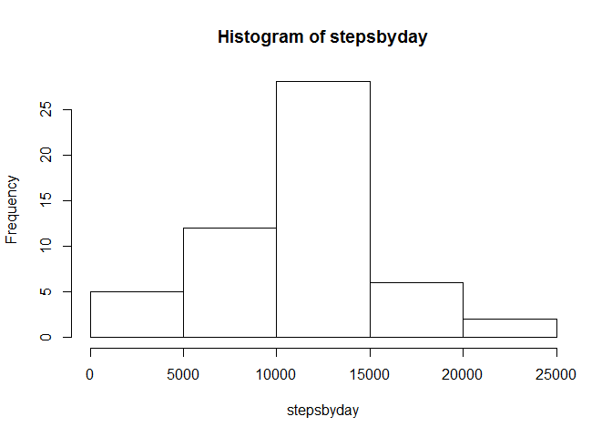
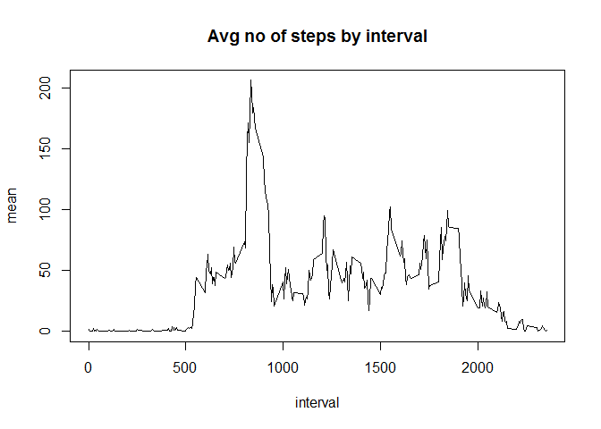
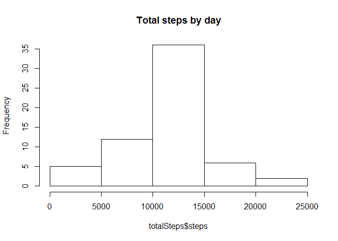

# Reproducible Research: Peer Assessment 1


## Loading and preprocessing the data

This data is found in the GitHub repository that was forked.


```r
activityfile <- read.csv("c:/Users/Vince/Documents/R/win-library/3.1/ReproducibleR/RepData_PeerAssessment1/activity/activity.csv")
```

To convert date into date format


```r
activityfile$date <- as.Date(activityfile$date)
```

## What is mean total number of steps taken per day?

* Ignore records with Steps = NA

```r
activityfile.narm <- activityfile[!is.na(activityfile$steps), ]
```

* Sum up number of steps by day

```r
stepsbyday <- rowsum(activityfile.narm$steps, activityfile.narm$date)
```

* Plot histogram

```r
hist(stepsbyday)
```

 

* Calculate mean

```r
mean(stepsbyday)
```

```
## [1] 10766.19
```

* Calculate median

```r
median(stepsbyday)
```

```
## [1] 10765
```


## What is the average daily activity pattern?

*Sum up number of steps by interval

```r
library(plyr)
stepsbyinterval <- ddply(activityfile.narm, ~interval, summarise, mean=mean(steps))
```

* generate plot

```r
plot(mean ~ interval, data=stepsbyinterval, type="l", main="Avg no of steps by interval")
```

 

*Find the interval with highest average no of steps


```r
stepsbyinterval[which.max(stepsbyinterval$mean), ]
```

```
##     interval     mean
## 104      835 206.1698
```


## Imputing missing values

* Calculate total number of missing value in steps

```r
nrow(activityfile[is.na(activityfile$steps), ])
```

```
## [1] 2304
```

* Replace NA with mean in 5 min interval

```r
meanSteps <- aggregate(steps ~ interval, data = activityfile, FUN = mean)
imputeNA <- numeric()
for (i in 1:nrow(activityfile)) {
    row <- activityfile[i, ]
    if (is.na(row$steps)) {
        steps <- subset(meanSteps, interval == row$interval)$steps
    } else {
        steps <- row$steps
    }
    imputeNA <- c(imputeNA, steps)
}
```

* create new data

```r
activityfile.imputed <- activityfile
activityfile.imputed$steps <- imputeNA
```

* Create histogram of total no of steps taken each day

```r
totalSteps <- aggregate(steps ~ date, data = activityfile.imputed, sum, na.rm = TRUE)  
hist(totalSteps$steps, main = "Total steps by day")
```

 

* calculate mean

```r
mean(totalSteps$steps)
```

```
## [1] 10766.19
```

* calculate median

```r
median(totalSteps$steps)
```

```
## [1] 10766.19
```

## Are there differences in activity patterns between weekdays and weekends?

* create a variable indicating weekdays and weekend

```r
day <- weekdays(activityfile$date)
dayind <- vector()
for (i in 1:nrow(activityfile)) {
    if (day[i] == "Saturday") {
        dayind[i] <- "Weekend"
    } else if (day[i] == "Sunday") {
        dayind[i] <- "Weekend"
    } else {
        dayind[i] <- "Weekday"
    }
}
activityfile$dayind <- dayind
activityfile$dayind <- factor(activityfile$dayind)

stepsbyday <- aggregate(steps ~ interval + dayind, data = activityfile, mean)
names(stepsbyday) <- c("interval", "dayind", "steps")
```

* create a panel plot with time series

```r
library(lattice)
xyplot(steps ~ interval | dayind, stepsbyday, type = "l", layout = c(1, 2), 
    xlab = "Interval", ylab = "Number of steps")
```

 


